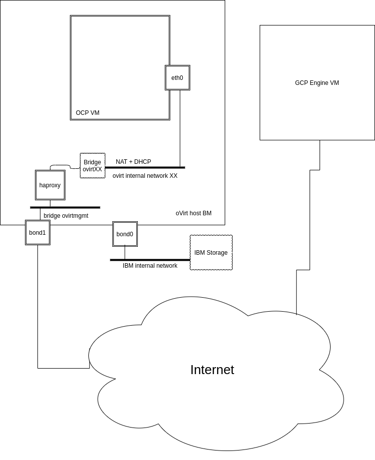

# ocp-on-rhv CI  env bringup

---

## bring up the Engine on GCP using terraform

- obtain service key from GCP place it in ocp-on-rhv-service.json.
- generate ssh key pair to access the engine
- apply terraform script

  this script will:
  - create network/subnetwork for the engine instance.
  - create the engine instance.
  - create the GCP FW rules to allow internal/outside communication.

  ```shell
    source scripts/env.sh
    terraform init
    terraform apply
  ```


## configure  external access to oVirt GCP engine.

- check if the engine public address is available and in status `RESERVED`:

  ```shell
  gcloud compute addresses list --filter="name~'ocp-on-rhv-engine'"
  NAME                  ADDRESS/RANGE  TYPE      PURPOSE  NETWORK  REGION       SUBNET  STATUS
  ocp-on-rhv-engine-vm  35.226.85.87   EXTERNAL                    us-central1          RESERVED

- if the address not available , new address can be created using command:
  ```
  gcloud compute addresses create ocp-rhv-static-ip-engine --region us-central1
  ```

- assign public IP address to the engine instance:

  ```bash
   gcloud compute instances add-access-config ocp-rhv-vm-engine --address  35.226.85.87 --zone us-central1-c
  ```

- verify DNS record exist and point to the engine address:

  ```shell
  gcloud dns record-sets list --zone=devcluster | grep -i engine

  # engine.rhv.gcp.devcluster.openshift.com.    A     60     35.226.85.87
  ```

- update /etc/hosts with the engine fqdn ( point to the internal IP )

  ```shell
  [root@ocp-rhv-vm-engine ~]# cat /etc/hosts  | grep engine.rhv.gcp.devcluster.openshift.com
  10.0.0.10 ocp-rhv-vm-engine.c.openshift-gce-devel.internal ocp-rhv-vm-engine engine.rhv.gcp.devcluster.openshift.com # Added by Google
  ```


## oVirt installation

- ssh to the engine with user centos.
- installing ovirt-engine 4.3
  ```
    sudo su
    yum install http://resources.ovirt.org/pub/yum-repo/ovirt-release43.rpm -y
    yum update -y
    yum install ovirt-engine -y
  ```

- run `engine-setup` , accept all the defaults :
    engine-fqdn: engine.rhv.gcp.devcluster.openshift.com

## oVirt UI configuration
- the manual configuration described in this document:
  https://docs.google.com/document/d/1ucF_jgAX0LauboDuaUoLeOc_zz0yj0VPMRr0U-Pj2Bs


## networking configuration
-  high level described in this drawing:
   
    https://www.draw.io/#G1VjPP1e5i_MtSPetnHKW7W-BKhVfxjn-e
   -    `ovirtmgmt` is the bridge that connected outside.
   -    each oVirt host can hold several clusters , each cluster
   must reside on its own l2 network .
   -    each cluster must have its  DNS A record
   for example cluster `cluster00`:
     api fqdn: api.ovirt00.gcp.devcluster.openshift.com ,
     it must resolve to one of the ovirtmgmt public addresses.
   -  haproxy frontend listens to the incoming connections on public fqdn address  and forward the connection to the internal network.
-


   -
- BM haproxy installation script - tbd
- uploading rchos template  - tbd
## monitoring - tbd